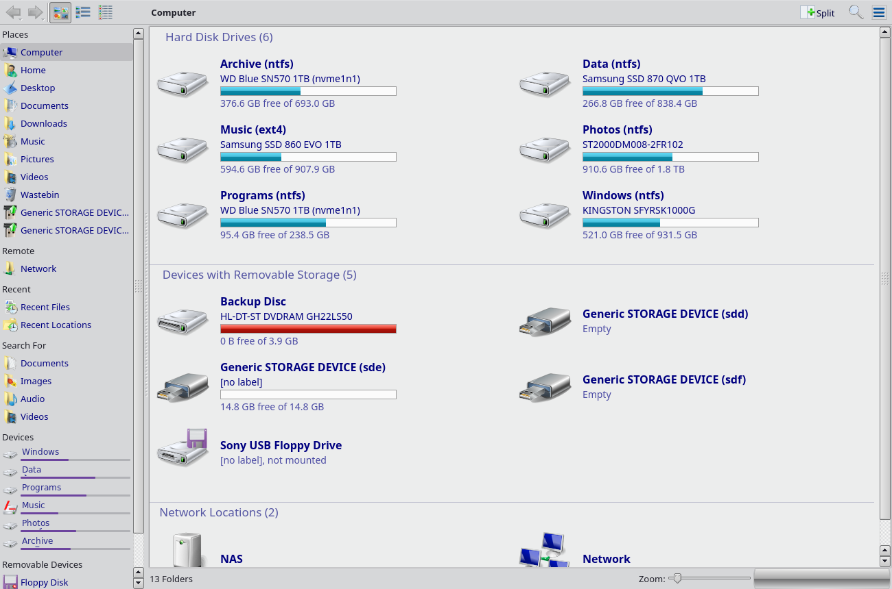

# Exxos desktop — Windows 7 for MX Linux 23

> **ALPHA.** Built and tested on **MX 23 only** (Debian 12, Plasma 5.27,
> KF5 5.103, Qt 5.15.8, amd64). No other release is tested or supported, and
> the Dolphin in this package is compiled against that exact ABI — on anything
> else it will not start. Treat it as something to try, not something to rely
> on.



## What this is for

Someone moving from Windows 7 to Linux does not usually want to learn a new
desktop. They want their files where they left them, drives that show how full
they are, a Start menu that behaves, and a machine that notices when a disc is
put in it. Most of that is possible in Plasma already — but only after a lot of
fiddling, and several pieces of it are simply missing.

The aim is to close that gap: to make MX Linux usable on day one by someone
whose habits were formed on Windows, without asking them to change those habits
first, and without breaking anything for anyone who does not want it.

That last part matters. Nothing here replaces a system file. The packaged
Dolphin stays exactly where apt put it and keeps working; this installs beside
it. Removing the package puts the machine back.

## What is in it

### Dolphin Exxos Edition

A patched Dolphin 22.12.3 with the Explorer drive view Plasma does not have.

* **Tile view for drives.** Icon on the left; the volume's name, the hardware
  it lives on, a graphical capacity bar and the free space stacked beside it,
  flowed into columns. Turns red past 90% full, as Explorer does.
* **A real `computer:/`.** Every drive, including **empty bays** — an empty
  card slot or an optical drive with no disc is listed and says so, instead of
  vanishing and leaving you wondering whether the machine can see the drive at
  all. Groups them as Explorer does: Hard Disk Drives, Devices with Removable
  Storage, Network Locations.
* **Media changes are noticed.** A floppy, a card, or a disc going in or out
  updates the view by itself, with a Windows 7 style spinner on the drive being
  read so you can see which one is working.
* **Network machines are found.** Windows boxes and NAS units announce
  themselves over WS-Discovery; they are listed under Network by address, which
  is what makes them work on a Linux box that cannot resolve NetBIOS names.
* **Mount and eject** from a drive's context menu, and an optional auto-mount
  that states plainly what the risk is before you switch it on.

### The theme

Window decorations, Plasma theme, colour scheme, Start menu styling and a
classic Windows-style icon set.
Installed by the package; applied per user with `exxos-theme-apply`, because a
theme lives in your own configuration and a package installs for everybody.

The icon theme is in **`exxos-icons`**, which apt installs alongside the
desktop package by default, so it looks right from the first login rather than
falling back to Breeze. It is kept as a separate package because it is 385 MB
installed — twenty times everything else here — and the desktop works without
it if you would rather not have it.

The artwork is by Blackcrack (blackysgate.de) under CC BY-NC-SA. That licence
allows it to be redistributed, including modified, **provided the author is
credited and the same licence is kept** — so the credit stays in the package
and is not something that can be dropped.

## Installing

```bash
sudo mkdir -p /etc/apt/keyrings
sudo wget -O /etc/apt/keyrings/exxos-archive-keyring.gpg \
     https://exxosuk.github.io/dolphin-exxos/exxos-archive-keyring.gpg

echo "deb [signed-by=/etc/apt/keyrings/exxos-archive-keyring.gpg] https://exxosuk.github.io/dolphin-exxos alpha main" \
  | sudo tee /etc/apt/sources.list.d/exxos.list

sudo apt update
sudo apt install exxos-desktop
exxos-theme-apply          # as your normal user, not with sudo
```

The suite is called `alpha` on purpose: the state of the thing is visible in
the apt line itself, not only in a description nobody reads.

Or install the `.deb` on its own, from the
[releases page](https://github.com/exxosuk/dolphin-exxos/releases):

```bash
sudo apt install ./exxos-desktop_<version>_amd64.deb
```

Log out and back in for the window decorations.

Removing it:

```bash
sudo apt remove exxos-desktop
exxos-theme-apply --undo
sudo rm /etc/apt/sources.list.d/exxos.list \
        /etc/apt/keyrings/exxos-archive-keyring.gpg
```

## Why some things are the way they are

Several decisions here look odd until you know what was behind them. The full
account, with the measurements, is in `THEME-LOG.md`; the short version:

* **The desktop entry is shadowed, not replaced.** `/usr/local/share` is
  searched before `/usr/share`, so a desktop file with the same id takes
  precedence without touching the packaged one. Removing the package restores
  stock Dolphin with no repair step.
* **A udev rule polls removable drives.** A USB floppy reports no media change
  and nothing polls it, so swapping a disk was invisible to the entire desktop
  until something unrelated happened. The optical drive only works because
  Debian already ships a rule that polls *it*. `udisks Block.Rescan` was
  measured and does not help: the kernel's size changed and udisks stayed at 0
  through the rescan.
* **The poll is 5 seconds, not 2.** The check is a question rather than a read,
  but a USB floppy answers it by moving its head, and every two seconds is
  audible across a room. `install-media-polling.sh --interval` changes it.
* **Empty bays are listed under "Places", not "Removable Devices".** They
  cannot be grouped correctly: an item is grouped as a removable device only if
  its bookmark carries a device id, and `KFilePlacesModel` discards a bookmark
  carrying one unless the device has a mountable volume — which is exactly what
  an empty bay does not have. Showing it in a less tidy section is worse than
  ideal; not showing it at all asserts there is no drive there, which is false.

## Version numbers

`MAJOR.MINOR.PATCH`, from `VERSION`, generated into the build so the title bar,
the package and the git tag cannot disagree.

* **PATCH** — every change
* **MINOR** — every push, so a version number identifies a published build
* **MAJOR** — a deliberate break: a rebase onto a new Dolphin, or a change to
  how it installs

`./bump-version.sh --patch|--minor|--major`

## Building it yourself

```bash
./deploy.sh                       # build and run it from the source tree
./packaging/build-deb.sh          # build the .deb
./packaging/publish-apt.sh        # build the apt repo locally
./packaging/publish-apt.sh --push # ...and publish it
```

`deploy.sh` prints the binary and worker actually running afterwards, because
testing against a stale build is the single most expensive mistake available
here — see `THEME-LOG.md`.

## Credits and licence

**Dolphin** is by the KDE community, GPL-2.0-or-later. The patches here keep
that licence.

**The icon theme** is by **Blackcrack** (<https://www.blackysgate.de>), licensed
**CC BY-NC-SA** — Attribution, NonCommercial, ShareAlike. It is redistributed
here under those terms: the author is credited, the licence is unchanged, and
the theme's own `COPYING`, `AUTHORS` and `Readme.md` ship inside it. Two
consequences follow and are worth stating plainly — this package **may not be
sold**, or bundled with anything sold, and anyone redistributing a modified
icon set must do so under the same licence.

Modifications made to it: a handful of icons containing embedded bitmap images
were dropped for size, editor metadata was stripped, and leftover files from
this machine's own repairs were removed. No artwork was redrawn.

**The window decorations, Plasma theme and colour scheme** were collected from
the KDE store and are used here, not authored here.

Windows and Windows 7 are trademarks of Microsoft Corporation. This project is
not connected with Microsoft in any way; it reproduces the *behaviour* people
are used to, on their own machines.
